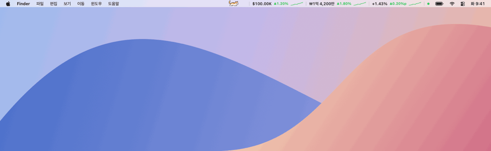
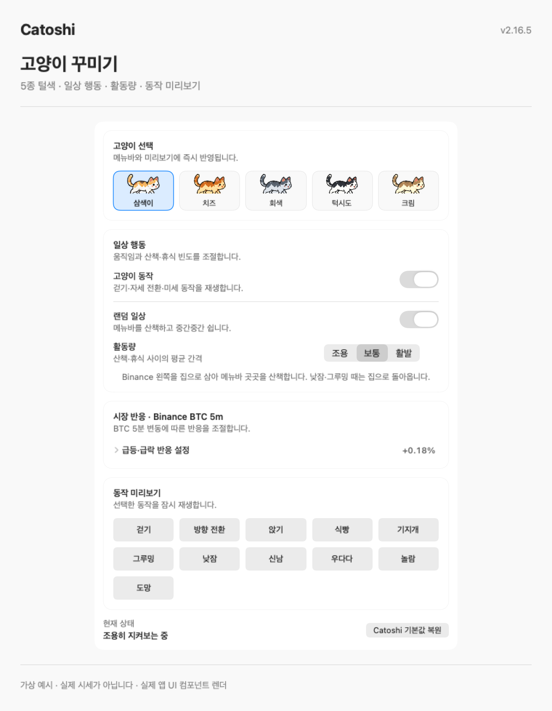
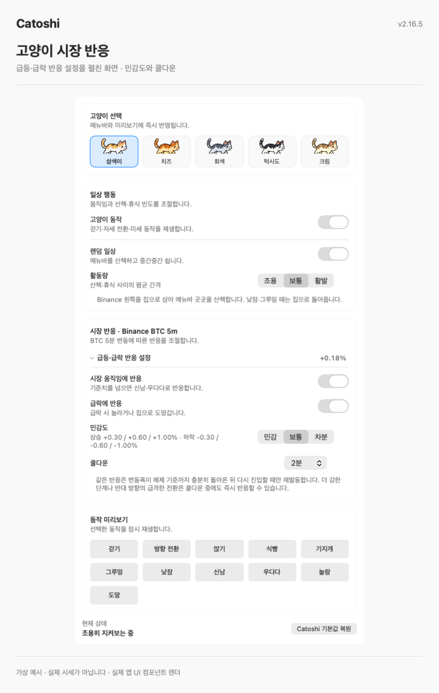
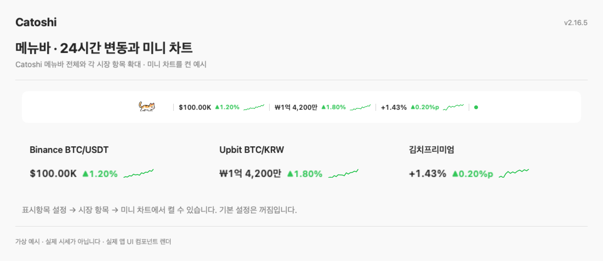
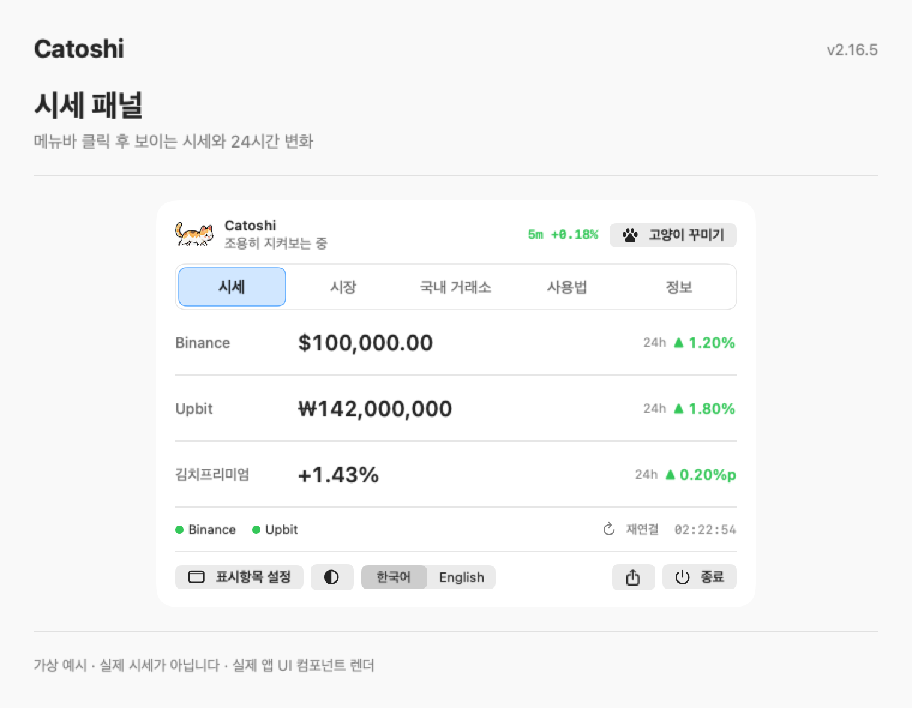
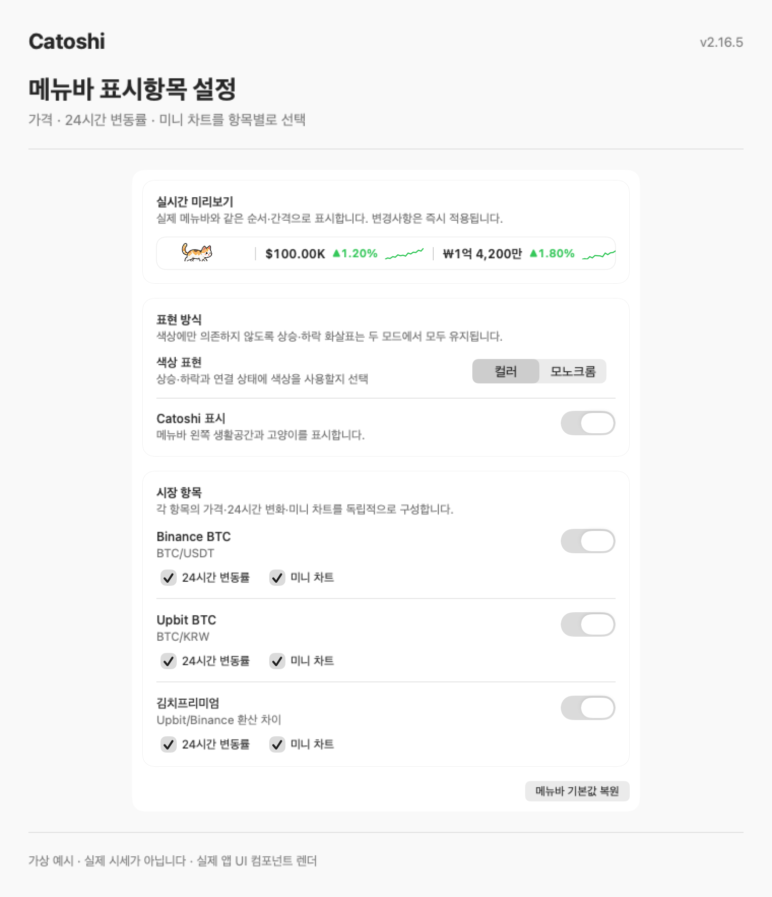
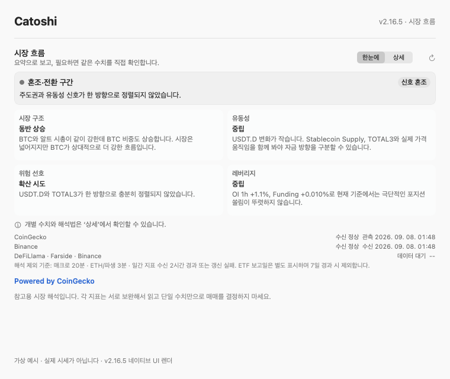
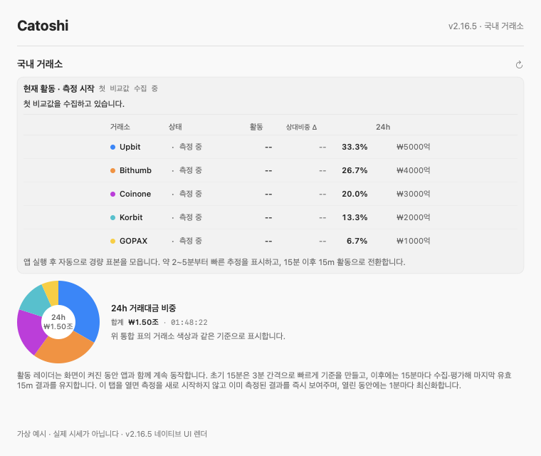
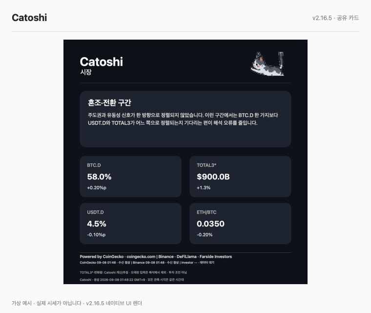
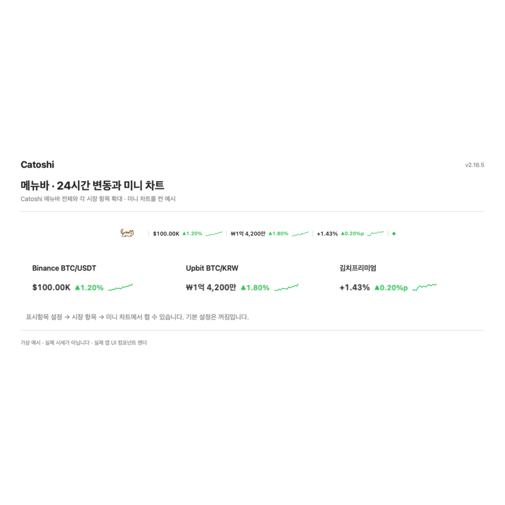

# Catoshi 🐈

**메뉴바에 사는 작은 고양이, Catoshi.**

고양이가 Mac 메뉴바를 산책하고, 방향을 돌리고, 식빵을 구우며 쉽니다. 그 곁에서 BTC 시세와 김치프리미엄도 확인하세요.



*12초 반복 · 실제 앱 UI와 고양이 동작으로 재현한 macOS 메뉴바 예시입니다. 시세는 가상 데이터입니다.*

Catoshi는 **비상업적 개인 사용을 위한 macOS 메뉴바 앱**입니다. 고양이의 털색과 일상을 고르고, Binance·Upbit 가격, 시장 흐름, 국내 거래소 활동을 확인할 수 있습니다. 소스를 내려받아 자신의 Mac에서 직접 빌드합니다. 사용 범위는 아래 라이선스 안내를 확인하세요.

> A little cat that walks and rests in your Mac menu bar, with Bitcoin and Korean market data alongside it. Source-available, for non-commercial personal use only.

**버전: v2.16.5** · [변경 이력](docs/CHANGELOG.md) · [설치·업데이트·복구](docs/BUILDING.md)

## 주요 기능

- 메뉴바에서 걷고, 쉬고, 식빵을 굽는 고양이: 산책·그루밍·낮잠 등 일상 행동
- 5종 고양이 털색, 산책·휴식 활동량과 동작 미리보기, 급등·급락 반응·민감도·쿨다운 설정
- Binance `BTC/USDT`, Upbit `BTC/KRW`, 김치프리미엄 메뉴바 표시
- 24시간 변동·미니 차트, BTC.D·TOTAL3·ETH/BTC·OI·Funding 등 시장 맥락
- 국내 5개 거래소의 거래대금 비중과 Activity Radar
- BTC·김프·시장 맥락·국내 거래소 수치를 담는 공유 카드: Feed / Story / Square, 이미지·캡션 복사, PNG 저장, macOS 시스템 공유
- 로그인·거래소 계정·지갑 연결·사용자 API Key 입력 없음

데이터 수신 실패와 오래된 상태를 확인할 수 있습니다. 공유 카드에는 출처·기준 시각과 해당하는 추정·불완전 상태를 표시합니다. 외부 데이터는 지연되거나 수신되지 않을 수 있으며 자동 해석은 투자자문이나 매매 권유가 아닙니다. 공유할 때는 포함된 데이터 제공자의 조건을 확인하세요. [출처와 확인된 조건·미확인 사항](docs/DATA_SOURCES.md)을 함께 정리했습니다.

## 설치

완성된 `.app`이나 `.dmg` 파일을 배포하지 않습니다. **공개 릴리스의 Source code ZIP → Apple 개발 도구 → `bash setup.sh`** 순서로 자신의 Mac에서 빌드합니다. 터미널이 처음이라면 [전체 설치 가이드](docs/BUILDING.md)를 따라 주세요.

### 1. 공개 릴리스 소스 받기

[GitHub Releases](https://github.com/Rayeonjin/Catoshi/releases)에서 설치할 버전을 선택하고 **Source code ZIP**을 받아 압축을 풉니다. 기본 브랜치의 `Code → Download ZIP`은 개발 중 변경이 포함될 수 있으므로 릴리스 ZIP을 사용합니다.

### 2. Apple 개발 도구 설치

Spotlight에서 **터미널**을 열고 실행합니다.

```bash
xcode-select --install
```

이미 설치되어 있다는 메시지는 정상입니다. 설치 후 확인합니다.

```bash
xcrun swift --version
```

### 3. 폴더로 이동해 설치

터미널에 `cd `를 입력한 다음 압축을 푼 폴더를 끌어다 놓고 Enter를 누릅니다. 이어서 실행합니다.

```bash
chmod +x *.sh
bash setup.sh
```

빌드와 검증이 끝나면 `~/Applications/Catoshi.app`에 설치됩니다. **Dock이 아닌 화면 위쪽 메뉴바**에서 Catoshi를 찾으세요.

Homebrew, 거래소 API Key, 유료 Apple Developer 계정은 필요하지 않습니다.

## 업데이트와 이전 버전 복구

새 릴리스의 **Source code ZIP**을 별도 폴더에 풀고 그 폴더에서 `bash setup.sh`를 실행합니다. 기존 앱을 먼저 지우지 마세요. 새 앱은 검증을 거쳐 교체하며 이전 앱은 `~/Applications/Catoshi.previous.app`에 한 개 보관합니다. 설정과 Activity Radar 기록은 유지합니다.

업데이트 후 실행 문제가 생기면 같은 소스 폴더에서 [이전 앱으로 복구](docs/BUILDING.md#이전-앱으로-복구) 절차를 따르세요. 릴리스 ZIP과 최신 개발 소스의 스크립트 위치를 구분해 안내합니다.

복구는 앱 버전을 바꾸며 과거 시점의 설정·시장 기록을 되돌리는 기능은 아닙니다. 자세한 절차와 Git 설치 방법은 [설치·업데이트·복구 가이드](docs/BUILDING.md)를 참고하세요.

## 화면과 데모

아래 화면은 현재 앱의 실제 SwiftUI/AppKit 컴포넌트를 가상 예시 데이터로 렌더링했습니다. 메뉴바 장면은 macOS 데스크톱 구성을 재현했으며, 다른 화면에는 설명용 제목·여백을 더했습니다. 실제 사용자 화면이나 시장 캡처가 아닙니다.

### 고양이가 사는 메뉴바

고양이는 화면 맨 위 메뉴바의 Catoshi 영역을 산책하고, 잠깐 멈춰 주변을 살피고, 앉거나 식빵 자세로 쉽니다. Finder 메뉴와 시스템 아이콘 사이, 시세 곁에 고양이가 머뭅니다.


### 내 고양이 꾸미기와 시장 반응

메뉴바를 눌러 시세 패널을 열고 상단의 **고양이 꾸미기**로 들어갑니다. 다섯 가지 털색을 고르고, 고양이 동작·랜덤 일상·활동량을 설정합니다. 걷기·식빵·그루밍·낮잠·우다다 등 동작을 미리 볼 수 있습니다.



**급등·급락 반응 설정**을 펼치면 BTC 5분 변동에 대한 반응, 급락 반응, 민감도와 쿨다운을 조절할 수 있습니다.



### 고양이 곁의 시세와 미니 차트

BTC 가격·24시간 변동·김치프리미엄과 미니 차트를 함께 볼 수 있습니다. **미니 차트는 기본으로 꺼져 있으며, `표시항목 설정 → 시장 항목 → 미니 차트`에서 켤 수 있습니다.** 아래는 세 항목의 차트를 모두 켠 예시입니다.



메뉴바를 누르면 시세 패널이 열립니다. 상단의 **고양이 꾸미기**와 하단의 **표시항목 설정**에서 원하는 모습으로 바꿉니다.



### 메뉴바 표시항목 설정

Binance·Upbit·김치프리미엄의 가격, 24시간 변동, 미니 차트를 각각 켜고 끕니다. 색상 표현과 Catoshi 표시도 선택할 수 있습니다. 설정 안의 실시간 미리보기는 가로로 스크롤할 수 있습니다.



### 시장·국내 거래소·공유 카드







<details>
<summary>전체 화면 둘러보기 · 약 28초</summary>



메뉴바·시세 패널·표시항목 설정·고양이 꾸미기·급등락 반응 설정·시장·국내 거래소·공유 카드의 8장면을 순서대로 보여 줍니다. 네이티브 UI로 만든 화면 예시이며, 표시된 숫자는 가상 데이터입니다.

</details>

데이터 이용 조건은 [데이터 출처](docs/DATA_SOURCES.md)에 정리합니다. 앱 화면의 시장 수치를 외부에 다시 게시할 권리가 이 소프트웨어 라이선스만으로 부여되지는 않습니다.

## 채널과 지원

- [GitHub](https://github.com/Rayeonjin/Catoshi): 소스·릴리스·빌드 문서·버그 제보
- [Telegram](https://t.me/Rayeonjin): 공지·업데이트·간단 문의

지원은 현재 공개 버전의 표준 설치 경로와 재현 가능한 앱 문제를 중심으로 진행합니다. 개인 프로젝트이므로 응답 기한이나 상시 지원을 보장하지 않습니다. 문제를 제보할 때 앱 버전, macOS·칩, ZIP/Git 여부, 실패 단계와 오류 메시지를 적어 주세요. [문제 해결](docs/TROUBLESHOOTING.md)도 먼저 확인할 수 있습니다.

## 개발 응원하기

Catoshi를 즐겁게 사용하고 있다면 **[Fairy에서 개발 응원하기](https://fairy.hada.io/@catoshi)** 로 자발적인 후원을 보내실 수 있습니다.

다른 후원 방법: [Buy Me a Coffee](https://buymeacoffee.com/rayeonjin) · [Ko-fi](https://ko-fi.com/rayeonjin)

후원은 사용권·기능 제공의 대가가 아니며 기능·업데이트·지원 우선순위에 차이가 없습니다.

후원 안내는 README와 Telegram에만 두며 앱과 공유 이미지·캡션에는 넣지 않습니다.

## 데이터와 개인정보

Catoshi는 제공자의 공개 인터페이스에서 시장 데이터를 직접 읽습니다. 로그인 정보, 거래소 API Key, 지갑 키, 거래 계정 정보를 요구하지 않습니다. 출처·용도·이용 조건은 [DATA_SOURCES.md](docs/DATA_SOURCES.md)를 확인하세요.

외부 데이터 제공자의 API·웹페이지·조건은 변경될 수 있습니다. 개인 사용과 직접 빌드는 제3자 데이터의 수집·가공·표시·공유 권한을 자동으로 부여하지 않습니다.

## 지원 환경

- macOS 13 이상
- Apple Silicon (`arm64`) 또는 Intel (`x86_64`) Mac
- Swift 5.9 이상 및 Xcode Command Line Tools

현재 Mac의 native architecture로 빌드합니다. 위 항목은 지원 대상이며 모든 Mac·macOS 조합에서 실행 검증을 마쳤다는 의미는 아닙니다. 릴리스의 실제 검증 환경과 미확인 항목은 릴리스 기록을 확인하세요.

## 라이선스

Catoshi는 **비상업적 개인 사용만 허용하는 소스 공개(source-available) 프로젝트**입니다. OSI 정의의 오픈소스 라이선스는 아닙니다.

개인 스스로의 비상업적 학습·연구를 포함해 소스를 내려받아 빌드·사용·수정하고 동일 조건으로 소스를 무료 공유할 수 있습니다. 회사 내부 모니터링·업무·기관 교육·연구·고객 작업, 실행파일 재배포, 상업적 판매·서비스 제공은 별도 사전 서면 허가가 필요합니다. [LICENSE](LICENSE)가 정확한 조건을 정합니다. 제3자 데이터 권리는 포함되지 않습니다.

## 문서

- [설치·업데이트·복구](docs/BUILDING.md)
- [문제 해결](docs/TROUBLESHOOTING.md)
- [데이터 출처](docs/DATA_SOURCES.md)
- [보안](.github/SECURITY.md)
- [기여 방법](.github/CONTRIBUTING.md)
- [변경 이력](docs/CHANGELOG.md)
- [제3자 고지](docs/THIRD_PARTY_NOTICES.md)
